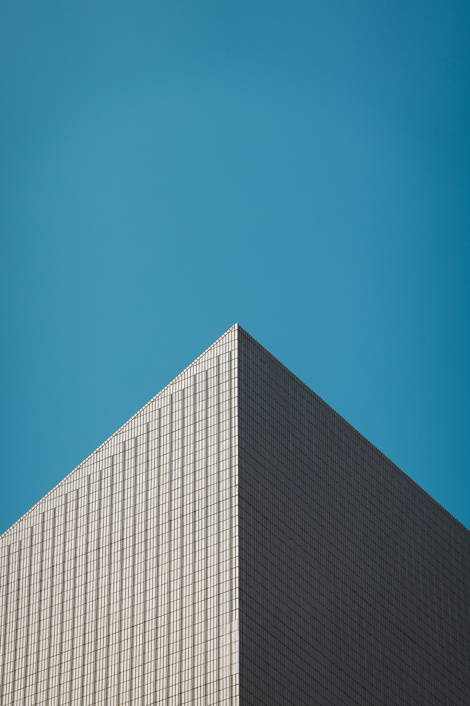
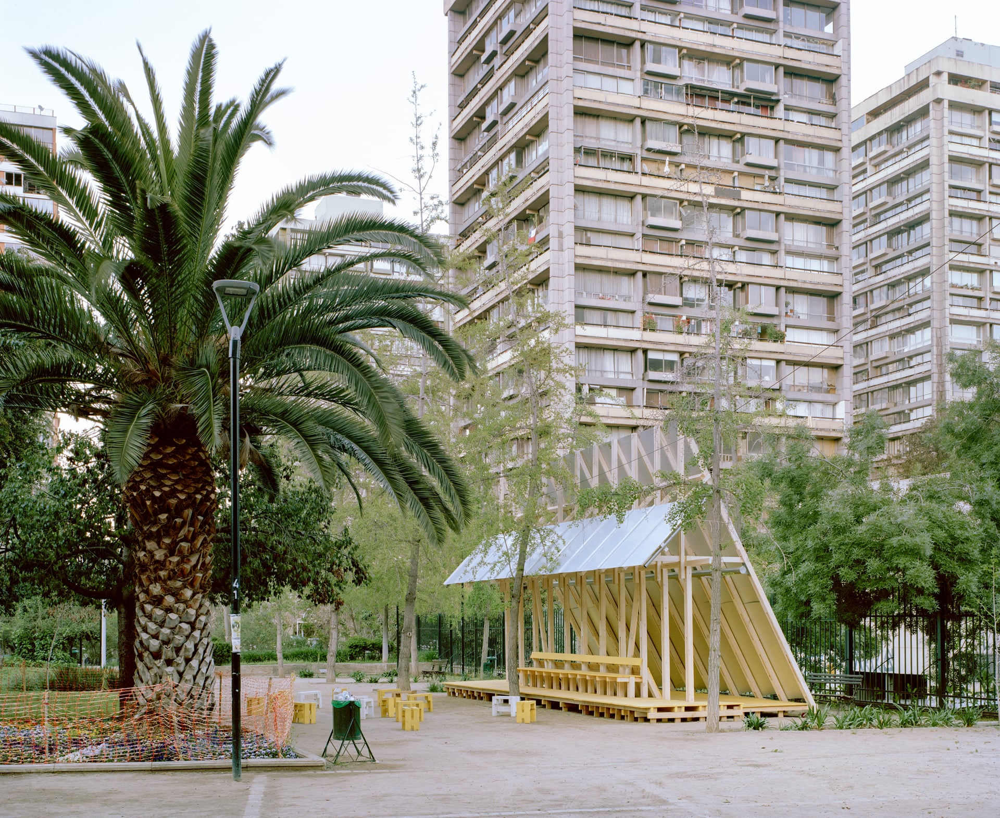

# Sharpey Report

> 3 images processed | Sizes: 320, 640, 1024, 1920 | Formats: avif, webp, jpeg

## Setup

1. Copy `sharpey-manifest.json` to your project (e.g. `src/assets/`)
2. Copy `ImgLazy.vue` to your components directory
3. Set `VITE_SHARPEY_BASE_PATH` in your `.env` to the public URL where images are served

```env
VITE_SHARPEY_BASE_PATH=/images/
```

---

## `arch`

Original: 3577x5366 | Variants: 12 | Total: 2.1 MB

### Preload hint (`<head>`)

```html
<link
  rel="preload"
  as="image"
  type="image/avif"
  imagesrcset="arch-320.avif 320w, arch-640.avif 640w, arch-1024.avif 1024w, arch-1920.avif 1920w"
  fetchpriority="high"
>
```

### ImgLazy component (recommended)

```vue
<script setup>
import manifest from '@/assets/sharpey-manifest.json'
import ImgLazy from '@/components/ImgLazy.vue'
</script>

<template>
  <!-- loading="eager" for LCP hero images, "lazy" for below-the-fold -->
  <ImgLazy
    :image="manifest.arch"
    loading="eager"
    alt=""
  />
</template>
```

### Raw picture element

```html
<picture>
  <source type="image/avif" srcset="arch-320.avif 320w, arch-640.avif 640w, arch-1024.avif 1024w, arch-1920.avif 1920w">
  <source type="image/webp" srcset="arch-320.webp 320w, arch-640.webp 640w, arch-1024.webp 1024w, arch-1920.webp 1920w">
  
</picture>
```

### Background CSS

```css
.bg-arch {
  background-size: cover;
  background-position: center;
  /* fallback */
  background-image: url('arch-320.jpg');
  background-image: image-set(
    url('arch-320.avif') type('image/avif'),
    url('arch-320.webp') type('image/webp'),
    url('arch-320.jpg') type('image/jpeg')
  );
}

@media (min-width: 321px) {
  .bg-arch {
    background-image: url('arch-640.jpg');
    background-image: image-set(
    url('arch-640.avif') type('image/avif'),
    url('arch-640.webp') type('image/webp'),
    url('arch-640.jpg') type('image/jpeg')
  );
  }
}

@media (min-width: 641px) {
  .bg-arch {
    background-image: url('arch-1024.jpg');
    background-image: image-set(
    url('arch-1024.avif') type('image/avif'),
    url('arch-1024.webp') type('image/webp'),
    url('arch-1024.jpg') type('image/jpeg')
  );
  }
}

@media (min-width: 1025px) {
  .bg-arch {
    background-image: url('arch-1920.jpg');
    background-image: image-set(
    url('arch-1920.avif') type('image/avif'),
    url('arch-1920.webp') type('image/webp'),
    url('arch-1920.jpg') type('image/jpeg')
  );
  }
}
```

---

## `biennale`

Original: 3543x2901 | Variants: 12 | Total: 4.0 MB

### Preload hint (`<head>`)

```html
<link
  rel="preload"
  as="image"
  type="image/avif"
  imagesrcset="biennale-320.avif 320w, biennale-640.avif 640w, biennale-1024.avif 1024w, biennale-1920.avif 1920w"
  fetchpriority="high"
>
```

### ImgLazy component (recommended)

```vue
<script setup>
import manifest from '@/assets/sharpey-manifest.json'
import ImgLazy from '@/components/ImgLazy.vue'
</script>

<template>
  <!-- loading="eager" for LCP hero images, "lazy" for below-the-fold -->
  <ImgLazy
    :image="manifest.biennale"
    loading="eager"
    alt=""
  />
</template>
```

### Raw picture element

```html
<picture>
  <source type="image/avif" srcset="biennale-320.avif 320w, biennale-640.avif 640w, biennale-1024.avif 1024w, biennale-1920.avif 1920w">
  <source type="image/webp" srcset="biennale-320.webp 320w, biennale-640.webp 640w, biennale-1024.webp 1024w, biennale-1920.webp 1920w">
  
</picture>
```

### Background CSS

```css
.bg-biennale {
  background-size: cover;
  background-position: center;
  /* fallback */
  background-image: url('biennale-320.jpg');
  background-image: image-set(
    url('biennale-320.avif') type('image/avif'),
    url('biennale-320.webp') type('image/webp'),
    url('biennale-320.jpg') type('image/jpeg')
  );
}

@media (min-width: 321px) {
  .bg-biennale {
    background-image: url('biennale-640.jpg');
    background-image: image-set(
    url('biennale-640.avif') type('image/avif'),
    url('biennale-640.webp') type('image/webp'),
    url('biennale-640.jpg') type('image/jpeg')
  );
  }
}

@media (min-width: 641px) {
  .bg-biennale {
    background-image: url('biennale-1024.jpg');
    background-image: image-set(
    url('biennale-1024.avif') type('image/avif'),
    url('biennale-1024.webp') type('image/webp'),
    url('biennale-1024.jpg') type('image/jpeg')
  );
  }
}

@media (min-width: 1025px) {
  .bg-biennale {
    background-image: url('biennale-1920.jpg');
    background-image: image-set(
    url('biennale-1920.avif') type('image/avif'),
    url('biennale-1920.webp') type('image/webp'),
    url('biennale-1920.jpg') type('image/jpeg')
  );
  }
}
```

---

## `chile`

Original: 1080x1390 | Variants: 9 | Total: 415.9 KB

> Skipped sizes (larger than source): 1920

### Preload hint (`<head>`)

```html
<link
  rel="preload"
  as="image"
  type="image/avif"
  imagesrcset="chile-320.avif 320w, chile-640.avif 640w, chile-1024.avif 1024w"
  fetchpriority="high"
>
```

### ImgLazy component (recommended)

```vue
<script setup>
import manifest from '@/assets/sharpey-manifest.json'
import ImgLazy from '@/components/ImgLazy.vue'
</script>

<template>
  <!-- loading="eager" for LCP hero images, "lazy" for below-the-fold -->
  <ImgLazy
    :image="manifest.chile"
    loading="eager"
    alt=""
  />
</template>
```

### Raw picture element

```html
<picture>
  <source type="image/avif" srcset="chile-320.avif 320w, chile-640.avif 640w, chile-1024.avif 1024w">
  <source type="image/webp" srcset="chile-320.webp 320w, chile-640.webp 640w, chile-1024.webp 1024w">
  
</picture>
```

### Background CSS

```css
.bg-chile {
  background-size: cover;
  background-position: center;
  /* fallback */
  background-image: url('chile-320.jpg');
  background-image: image-set(
    url('chile-320.avif') type('image/avif'),
    url('chile-320.webp') type('image/webp'),
    url('chile-320.jpg') type('image/jpeg')
  );
}

@media (min-width: 321px) {
  .bg-chile {
    background-image: url('chile-640.jpg');
    background-image: image-set(
    url('chile-640.avif') type('image/avif'),
    url('chile-640.webp') type('image/webp'),
    url('chile-640.jpg') type('image/jpeg')
  );
  }
}

@media (min-width: 641px) {
  .bg-chile {
    background-image: url('chile-1024.jpg');
    background-image: image-set(
    url('chile-1024.avif') type('image/avif'),
    url('chile-1024.webp') type('image/webp'),
    url('chile-1024.jpg') type('image/jpeg')
  );
  }
}
```

---

